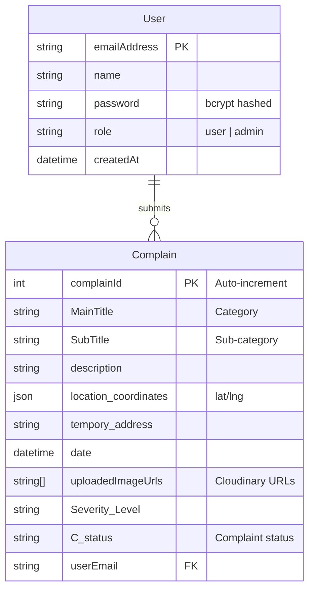

<p align="center">
  
</p>

<h1 align="center">Citizen Voice</h1>

<p align="center">
  <strong>A civic complaint management platform that empowers citizens to report public concerns, track resolutions, and communicate directly with authorities.</strong>
</p>

> 🌐 **Live App →** [citizen-voice-five.vercel.app](https://citizen-voice-five.vercel.app/)
>
> 🎬 **Demo & Videos →** [hasalagayendra.vercel.app/Projects/CitizenVoice](https://hasalagayendra.vercel.app/Projects/CitizenVoice)

<p align="center">
  
  
  
  
  
  
</p>

---

## 🎯 What is Citizen Voice?

Citizens face public issues daily — potholes, illegal dumping, corruption, broken infrastructure — but lack a unified, transparent channel to report them.

**Citizen Voice** solves this by providing:

- 📋 Structured complaint forms across **7 categories with 30+ sub-categories**
- 🗺️ Map-based location pinning with reverse geocoding
- 🖼️ Photo evidence upload via Cloudinary
- 🤖 AI assistant powered by **Gemini 2.5 Flash** for Sri Lankan public grievance guidance
- 💬 Real-time chat between citizens and administrators via Firebase
- 📊 Separate dashboards for citizens (track progress) and admins (manage & resolve)

---

## ⚡ Key Features

| Feature                       | Description                                                                                                  |
| ----------------------------- | ------------------------------------------------------------------------------------------------------------ |
| 🔐 **Auth**                   | Email/password (bcrypt) + Google OAuth via NextAuth                                                          |
| 📋 **7 Complaint Categories** | Environmental, Crime, Infrastructure, Illegal Construction, Corruption, Employee Misconduct, Public Services |
| 🗺️ **Interactive Map**        | Leaflet map — click to pin location + auto reverse geocoding                                                 |
| 🖼️ **Evidence Upload**        | Drag & drop images → Cloudinary storage                                                                      |
| 🤖 **AI Chatbot**             | Gemini 2.5 Flash for legal guidance on public grievances                                                     |
| 💬 **Admin Chat**             | Real-time Firebase messaging between citizens & admins                                                       |
| 📈 **Progress Tracking**      | Status timeline: Submitted → In Review → In Progress → Resolved                                              |
| 📄 **PDF Reports**            | Generate downloadable complaint reports                                                                      |
| 🎨 **Role-Based Dashboards**  | Separate admin & user views                                                                                  |

---

## 🔧 Tech Stack

### Frontend

| Technology              | Purpose                           |
| ----------------------- | --------------------------------- |
| **Next.js 15**          | App Router, Turbopack, SSR        |
| **React 19**            | UI components with hooks          |
| **Tailwind CSS 4**      | Styling                           |
| **Zustand 5**           | Global state for multi-step forms |
| **Leaflet**             | Interactive maps                  |
| **Radix UI + MUI**      | UI component libraries            |
| **react-dropzone**      | Drag & drop file upload           |
| **@react-pdf/renderer** | PDF generation                    |

### Backend & Services

| Technology        | Purpose                               |
| ----------------- | ------------------------------------- |
| **Prisma 6**      | PostgreSQL ORM with migrations        |
| **NextAuth 4**    | Authentication (Credentials + Google) |
| **Firebase 11**   | Realtime Database for chat            |
| **Google Gemini** | AI chatbot                            |
| **Cloudinary**    | Image upload & storage                |
| **bcrypt**        | Password hashing                      |

---

## 📊 Database Design

**Dual-database architecture:** PostgreSQL for structured data + Firebase for real-time chat.



**Firebase:** `users/{id}/messages[]` — real-time chat messages between citizens and admins.

---

## 🔐 Authentication

```
┌───────────────────────┬──────────────────────┐
│  Credentials Login    │  Google OAuth 2.0    │
│  (email + bcrypt)     │  (auto-register)     │
└───────────┬───────────┴──────────┬───────────┘
            └──────────┬───────────┘
                       ▼
          NextAuth.js Session (JWT)
              │
              ├── role: "user"  → User Dashboard
              └── role: "admin" → Admin Dashboard
```

---

## 📝 Complaint Categories

| Category                     | Examples                                                          |
| ---------------------------- | ----------------------------------------------------------------- |
| 🌿 **Environmental Hazards** | Air/Water/Noise Pollution, Illegal Dumping, Toxic Exposure        |
| 🚨 **Crime & Safety**        | Theft, Assault, Drug Dealing, Vandalism, Suspicious Activities    |
| 🏗️ **Infrastructure**        | Potholes, Broken Lights, Flooding, Open Manholes, Traffic Signals |
| 🔨 **Illegal Construction**  | Unauthorized Buildings, Zoning Violations, Encroachment           |
| 💰 **Corruption & Bribery**  | Bribery, Tender Favoritism, Fund Misuse, Fake Billing             |
| 👤 **Employee Misconduct**   | Rude Behavior, Negligence, Discrimination, Absenteeism            |
| 🏥 **Poor Public Services**  | Water Supply, Electricity Outages, Healthcare Service             |

Each sub-category has **dynamic form fields** — the form adapts based on what you select (e.g., Crime adds witness fields, Construction adds danger assessment).

---

## 🤖 AI Chatbot

Built-in AI assistant powered by **Google Gemini 2.5 Flash**:

- Helps citizens understand their rights regarding Sri Lankan public grievance laws
- Accessible via a floating chat button (authenticated users only)
- Dual-mode: switch between **AI Bot** and **Admin Chat** tabs

---

## 💬 Real-Time Admin Chat

Bidirectional messaging using **Firebase Realtime Database**:

- **Citizens** send messages via the chat widget → stored in Firebase
- **Admins** see all users in a sidebar, click to view & reply
- Messages sync instantly via `onValue()` listeners — no polling

---

## 📁 Project Structure

```
Citizen-Voice/
├── prisma/
│   ├── schema.prisma              # User + Complain models
│   └── migrations/                # 9 migration files
│
├── src/
│   ├── app/
│   │   ├── page.jsx               # Landing page
│   │   ├── login/                 # Login (credentials + Google)
│   │   ├── signup/                # Registration with validation
│   │   ├── user_dashboard/        # Citizen complaint tracking
│   │   ├── admin_dashboard/       # Admin complaint management
│   │   ├── form/                  # Multi-step complaint form
│   │   └── api/                   # 10 API route handlers
│   │       ├── auth/[...nextauth] # NextAuth config
│   │       ├── aichat/            # Gemini AI endpoint
│   │       ├── uploadData/        # Complaint CRUD
│   │       ├── imageUpload/       # Cloudinary upload
│   │       ├── adminActions/      # Admin filtering
│   │       └── setStatus/         # Status updates
│   │
│   ├── components/
│   │   ├── Chat.jsx               # Dual-mode chat (Admin + AI)
│   │   ├── AdminChat.jsx          # Admin chat panel
│   │   ├── ComplainCard.jsx       # Complaint card with status timeline
│   │   ├── map.jsx                # Leaflet map with geocoding
│   │   ├── homePageComponents/    # 7 landing page sections
│   │   ├── forms/                 # 5 multi-step form components
│   │   ├── inputs/                # 13 reusable input components
│   │   └── ui/                    # Shadcn/Radix primitives
│   │
│   ├── lib/
│   │   ├── details.js             # 7 categories config (537 lines)
│   │   ├── firebaseConfig.js      # Firebase init
│   │   └── prisma.js              # Prisma client
│   │
│   └── store/
│       └── useGlobalStore.js      # Zustand (22 state fields)
│
└── package.json
```

---

## � Technical Highlights

### Config-Driven Dynamic Forms

Complaint forms are **not hardcoded** — they are generated dynamically from a central configuration object (`details.js`, 537 lines). Each sub-category defines which input components to render, making the system easily extensible without touching UI code:

```javascript
// Adding a new sub-category automatically generates the correct form
{
  id: "AirPollution",
  title: "Air Pollution",
  Icon: Cloudy,
  elements: [DiscrptionInput, MapSelection, DatePicker, FileDropBox]
}
```

### Dual-Database Architecture

- **PostgreSQL** (via Prisma) handles structured complaint data, user accounts, and relational queries
- **Firebase Realtime DB** handles real-time chat where latency matters — `onValue()` listeners provide instant message sync without polling

### Real-Time Bidirectional Chat

Firebase `onValue()` subscriptions on both the citizen and admin sides create a live messaging experience. Admin side renders a user list sidebar, and selecting a user loads their messages in real-time.

### Reverse Geocoding Pipeline

Map clicks capture coordinates → OpenStreetMap Nominatim API converts to human-readable addresses → both coordinates (`JSON`) and address (`String`) stored in the database for flexible querying.

### Cloudinary Upload Pipeline

Files received via `react-dropzone` → converted to Base64 Data URI in the API route → uploaded to Cloudinary via server-side SDK → secure CDN URLs stored as `String[]` in PostgreSQL.

### Multi-Strategy Auth with Role Injection

NextAuth JWT callbacks query the database for the user's role and inject it into the session token. This enables role-based UI rendering (`session.user.role`) and route protection across the entire app.

### AI Prompt Engineering

The Gemini chatbot uses a **domain-specific system prompt** that constrains responses to Sri Lankan public grievance laws and policies, preventing hallucination on unrelated topics.

---

## �🛠️ Skills Demonstrated

- **Full-Stack Development** — Next.js 15 with API routes, Prisma ORM, PostgreSQL
- **Authentication** — NextAuth.js with credentials + Google OAuth, role-based access
- **AI Integration** — Google Gemini 2.5 Flash chatbot with prompt engineering
- **Real-Time Systems** — Firebase Realtime Database for bidirectional chat
- **Cloud Services** — Cloudinary image uploads, OpenStreetMap geocoding
- **Map Integration** — Leaflet with click-to-pin and reverse geocoding
- **Complex UI Workflows** — Multi-step dynamic forms with Zustand state management
- **Component Architecture** — 40+ reusable components with clean separation

---

## � About the Team

**Built as a group project** to showcase full-stack development, AI integration, and civic technology skills.

> 🌐 **Live App →** [citizen-voice-five.vercel.app](https://citizen-voice-five.vercel.app/)
>
> 🎬 **Demo & Videos →** [hasalagayendra.vercel.app/Projects/CitizenVoice](https://hasalagayendra.vercel.app/Projects/CitizenVoice)

---

<p align="center">
  
  
</p>
